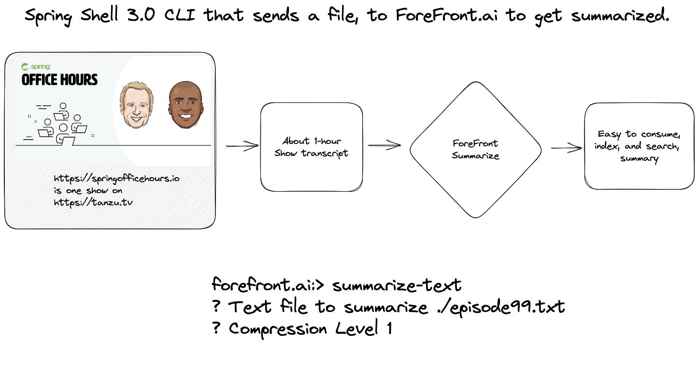

# forefront-ai-client



[ForeFront](https://www.forefront.ai/) has a "summarize" API, that allows me to send in larger blocks of text, than I can with the currently popular ChatGPT.

This client asks for an input file, compression level, and uses the ForeFront summarize API.

## Configuration

- `forefront.teamId` is the short-form of the team id
- `forefront.modelKey` is found in settings -> API Keys -> Model Keys

## Quick Start

```java
./mvnw spring-boot:run
```

